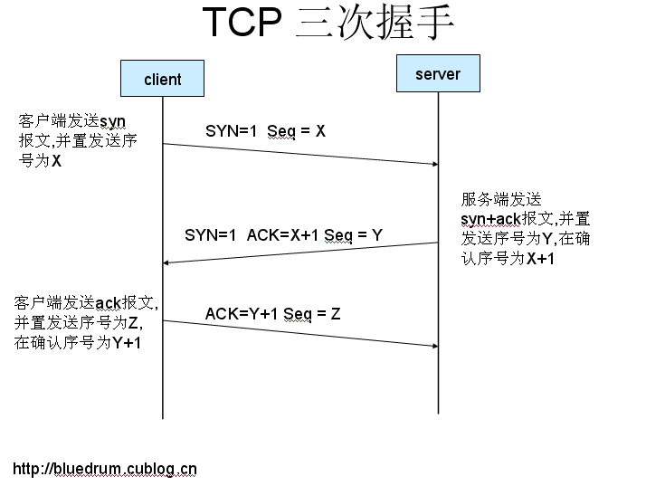

# TCP拆链的4次握手

TCP的连接的拆除需要发送四个包，因此称为四次挥手\(four-way handshake\)。客户端或服务器均可主动发起挥手动作，在socket编程中，任何一方执行close\(\)操作即可产生挥手操作。

**为什么建立连接协议是三次握手，而关闭连接却是四次握手呢？**

这是因为服务端的LISTEN状态下的SOCKET当收到SYN报文的连接请求后，它可以把ACK和SYN\(ACK起应答作用，而SYN起同步作用\)放在一个报文里来发送。但关闭连接时，当收到对方的FIN报文通知时，它仅仅表示对方没有数据发送给你了；但未必你所有的数据都全部发送给对方了，所以你可能未必会马上会关闭SOCKET,也即你可能还需要发送一些数据给对方之后，再发送FIN报文给对方来表示你同意现在可以关闭连接了，所以它这里的ACK报文和FIN报文多数情况下都是分开发送的。

